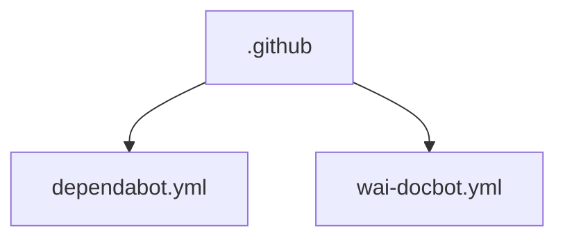

# 📚 ArtazzenMobile Documentation

Welcome to the complete documentation for this repository. This documentation is automatically generated and maintained by Woden Docbot.

  

## 🔗 Quick Links

[📂 .github](./github/README.md)

---

> Mobile Art Gallery app for iOS — a companion application to artazzen.com.

## 📖 Overview

ArtazzenMobile is the iOS mobile companion for artazzen.com, implemented as a mobile art gallery application. The codebase contains Swift source for the iOS app and some shell-based tooling found in the repository tree.

Repository operational configuration is grouped under .github: dependabot.yml is used to keep GitHub Actions dependencies up to date, and wai-docbot.yml configures how documentation is generated and where it is placed for pull requests and selected branches.

### 🧩 Key Components

| Component | Purpose | Technologies |
| --- | --- | --- |
| **.github** | Holds repository-level configuration that controls dependency updates and automated documentation generation for the project. | N/A |
| **dependabot.yml** | Configuration for Dependabot to keep GitHub Actions dependencies up to date. | N/A |
| **wai-docbot.yml** | Configuration that governs how documentation is generated and where it is placed for pull requests and selected branches. | N/A |

**Component Architecture:**

### 🏗️ Architecture

Swift-based iOS application source and shell tooling form the codebase; operational repo configuration (dependency management and docs automation) lives in the .github directory with dedicated YAML files.

### 💡 Use Cases

- ✦ iOS mobile companion app for artazzen.com
- ✦ Mobile art gallery browsing on iOS

### 🔧 Technologies

 

---

## 📑 Documentation Sections

### [.github](./github/README.md)
This directory holds repository-level configuration files that control dependency management and automated documentation generation for the project. The files declare behaviors that run on the repository root and shape how updates and pull-request documentation are produced and managed.

The contents are focused on operational configuration rather than application code: one file configures Dependabot to keep GitHub Actions dependencies up to date, and the other configures how documentation is generated and placed for pull requests and selected branches.

Readers should treat these files as independent configuration entry points: one governs automated updates to action dependencies, and the other governs how documentation is generated and where it is placed.

---

## 📊 Documentation Statistics

- **Files Documented**: 2
- **Directories**: 1
- **Coverage**: 3%
- **Eligible Source Files**: 65
- **Last Updated**: 2026-09-07

---

## 🧭 How to Navigate

> ℹ️ **INFO**
> Each directory has its own README.md with detailed information about that section. Use the breadcrumb navigation at the top of each page to navigate back to parent directories.

### Navigation Features

- **Breadcrumbs** - At the top of each page, showing your current location
- **Directory READMEs** - Each folder has a comprehensive overview
- **File Documentation** - Click through to individual file documentation
- **Search** - Use GitHub's search or your IDE's search functionality

---

## 🤖 About Woden DocBot

This documentation is automatically generated and kept up-to-date by Woden DocBot, an AI-powered documentation assistant. DocBot analyzes code on every pull request and updates documentation to reflect changes.

### Features

- **Automatic Updates** - Documentation updates on every PR
- **Comprehensive Coverage** - Files, functions, classes, and directories
- **Smart Navigation** - Breadcrumbs, related files, and parent links
- **AI-Powered** - Uses Azure GPT models for intelligent documentation generation

---

*Generated by Woden DocBot for ArtazzenMobile*